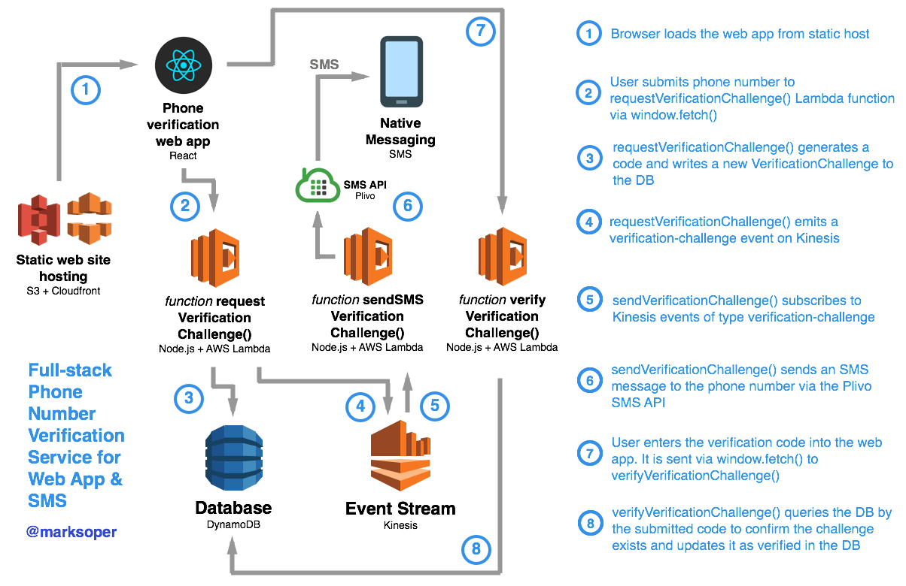

# Phone number verification with AWS Lambda Microservices, Kinesis, DynamoDB, Node.js, and React.js



As part of a larger project I recently built a self-contained web app that signs up a user by phone number and performs [phone number verification](https://en.wikipedia.org/wiki/Telephone_number_verification) by verifying his/her possession of that number. This might be interesting if you are:
- looking for a (non-production) example implementation of [phone number verification](https://en.wikipedia.org/wiki/Telephone_number_verification)
- interested in event-driven microservices (see [Pivotal](https://content.pivotal.io/blog/messaging-patterns-for-event-driven-microservices), [MapR](https://www.google.com/url?sa=t&rct=j&q=&esrc=s&source=web&cd=1&ved=0ahUKEwjHm5_0sarWAhVEKiYKHdmyAX4QFggoMAA&url=https%3A%2F%2Fmapr.com%2Fblog%2Fevent-driven-microservices-patterns%2F&usg=AFQjCNEB28EtCwymkT9oDHULByhKXRjn3A)) - serverless (AKA FaaS) microservice architecture using [AWS Lambda](https://aws.amazon.com/lambda/) in an event-driven architecture (see [Wikipedia](https://en.wikipedia.org/wiki/Event-driven_architecture), [Java design pattern](https://github.com/iluwatar/java-design-patterns/tree/master/event-driven-architecture)) based on [AWS Kinesis Streams](https://docs.aws.amazon.com/streams/latest/dev/introduction.html)

For full instructions, including the necessary AWS console configuration steps, see this blog post: [Phone number verification with AWS Lambda Microservices, Kinesis, DynamoDB, Node.js, and React.js](https://medium.com/@marksoper/Phone-number)

## webapp

```
cd ./webapp
yarn install
yarn start
```

## auth service

```
cd ./auth
yarn install
serverless deploy -v
```